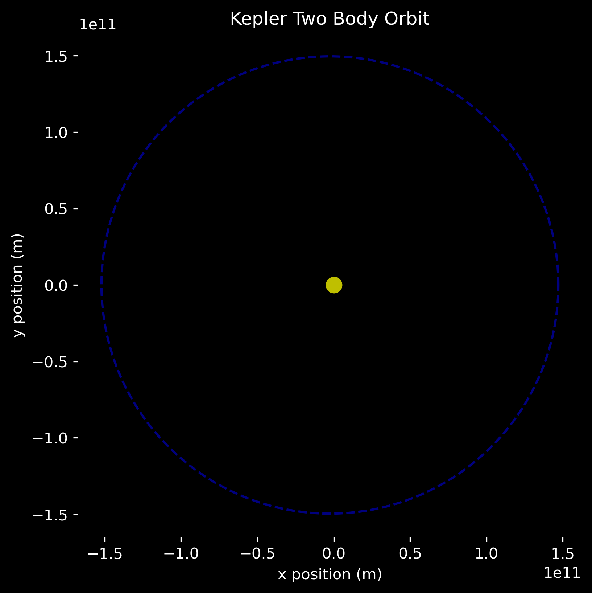

# Orbital Mechanics Simulation: Two Body System
## Overview
This project focuses on orbital mechanics within a two body system using python. Starting with an planet-star system, the plan is to implement different celestial bodies and complexities to the model while maintaining as much accuracy as possible. The complexity of the methods being used will increase over time as skills are developed and learned, from keplerian orbits to RK4 and more.
## Objectives
- Compute a two body orbital system representing a planet and a star 
- Plot and visualize results in 2D and 3D using matplotlib and other necessary libraries
- Explore multiple methods of solving and modeling these systems and determining which are most accurate
## Methods 
- Solving using ordinary differential equations through scipy
- Plotting through matplotlib
- Jupyter notebook for coding development
## References
[Keplerian Orbits](https://en.wikipedia.org/wiki/Kepler_orbit)

[Runge-Kutta Methods](https://en.wikipedia.org/wiki/Runge%E2%80%93Kutta_methods)

[Kepler's Equation](https://en.wikipedia.org/wiki/Kepler%27s_equation)

[Matplotlib Animation](https://matplotlib.org/stable/api/animation_api.html)

[Conservation of Energy in a Binary Stellar System](https://astrophytheory.com/2018/08/06/astrophysics-series-derivation-of-the-total-energy-of-a-binary-orbit/)

[Binary Star Systems](https://farside.ph.utexas.edu/teaching/336k/Newton/node50.html)

[NASA Earth Parameters](https://nssdc.gsfc.nasa.gov/planetary/factsheet/earthfact.html)

[Vis-Viva](https://en.wikipedia.org/wiki/Vis-viva_equation)
## Updates and Logs
2025-05-29: Researched Runge-Kutta, keplerian orbits, and started coding an ode function for rk4 method

2025-06-02: Decided to begin with keplerian orbits and once skills and knowledge develop further, search complex and more accurate methods such as RK4.
            Renamed and uploaded new code folder for the different methods

2025-06-04: Worked on the star-planet two body system (where the orbit is assumed to be in the same plane) in which the semi-major axis, eccentricity, and mass of the star at the foci point can be manipulated and plotted to find results. Orbital path is now visible. Issues with running and seeing animation.  

2025-06-05: Completed first draft of the two body keplerian star-planet system. Verified accuracy by inputting parameters equal to those present in our solar system such as the star mass, semi-major axis, and eccentricity and comparing results with known physical values. When code is ran through jupyter notebooks, the orbital animation is clear and presented with a text showing time passed throughout the orbit.

2025-06-06: Revised first final draft of the two body keplerian Earth-Sun System. Used pandas to store results and data in a csv file with 1,000 entries for smooth plotting and data analysis. Briefly derived math used in code to verify correct usage of units in data. Updated repo by adding a data folder where data from future models/simulations will be stored. 

2025-06-08: Began the second model, a keplerian binary stellar system. Researched binary systems, formulas, and concepts. Essentially beginning with the layout of the first model, changing, and adding formulas to account for two bodies of similar mass. 

2025-06-09: Completed first draft of a binary stellar system using keplerian methods, representing Alpha Centauri A and Alpha Centauri B with their exact parameters computed into the simulation. Results include: 1,000 entry csv file as seen on the data folder under "binarystar2D.csv", an animated simulation (can be seen through jupyter notebooks), and a still image posted in the results section. Further verification of accuracy is still required.

## Results 
### 2D Keplerian Orbit

### 2D Earth-Sun Simulation
.png)
### 2D Earth-Sun Simulation Data Small Sample (see data folder for whole data with all variables)
|Time Passed (days)| Orbital Radius (m) | Orbital Velocity (m/s) | Kinetic Energy (J)      | Potential Energy (J)        |
|------------------|----------|------------------|---------|-----------|
| 0.0000           | 1.47e11  | 30040.80         | 2.69e33 | -5.39e33  |
| 0.3656           | 1.47e11  | 30040.79         | 2.69e33 | -5.39e33  |
| 0.7312           | 1.47e11  | 30040.78         | 2.69e33 | -5.39e33  |
### 2D Alpha Centauri A & B Binary Stellar System
.png)
## License
[MIT License](LICENSE)
